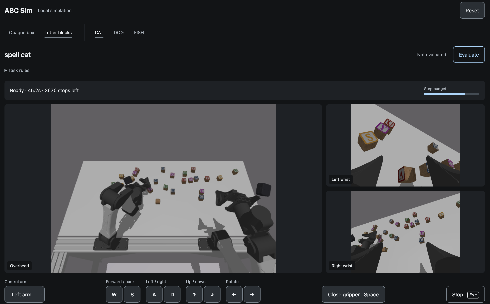

# ABC Inspect Playground

Control a simulated robot in Chrome or through a TUI agent using MCP. Runs locally
with ABC Sim, MuJoCo, and Inspect Robots—no robot hardware or policy weights needed.

[Roadmap](ROADMAP.md) · [Integration measurements](DERISK.md) · [AGPL-3.0-or-later](LICENSE)



## Quick start

Requires Git, `uv`, Chrome, and a graphics context for MuJoCo cameras. Tested on
macOS with an Apple M3 and 16 GiB RAM; other platforms are unverified.

```sh
git clone https://github.com/kimjune01/abc-inspect-playground.git
cd abc-inspect-playground
bash scripts/bootstrap.sh  # downloads pinned dependencies and assets
bash scripts/serve.sh
```

Open **http://127.0.0.1:8876/play** and click **Start**. If the server is already
running, reuse it.

| Control | Action |
| --- | --- |
| W / S | Forward / back |
| A / D | Left / right |
| ↑ / ↓ | Up / down |
| ← / → | Yaw left / right |
| Space | Open / close gripper |
| Arm selector | Choose left or right arm |
| Evaluate | End the attempt and score the result |
| Reset | Start a fresh scene |
| Escape | Stop sending commands |

Hold keys to move, or use the on-screen buttons. Releasing keys or leaving the
window stops new commands; an in-flight command completes. Cameras refresh after
each command, and physics pauses between commands. Translation uses world axes;
the wrist retains its tilt. Pitch/roll controls are not implemented.

The status shows the remaining step budget. Trials end after 1,000 physics ticks
(about 34 simulated seconds), with a “Step limit reached” message. Reset to continue; restart the server after
256 starts. The eight most recent trials remain available through the API; older
logs stay on disk. After restarting, refresh the page and click Start.

Choose a scene and task in the navigation bar. Switching saves the current attempt
and starts a fresh one.

| Scene | Tasks | Success criterion |
| --- | --- | --- |
| Opaque box | One, two, or three objects | Exactly that many objects inside, through the flap |
| Letter blocks | CAT, DOG, FISH | Correct letters in a tight left-to-right row on the table, faces up |

**Evaluate** ends the attempt without advancing physics. Grey means unscored,
green **Pass · 1/1**, red **Fail · 0/1**, amber unavailable. Let objects finish falling
before evaluating. Scores appear only after the trial ends.

These are ABC's documented task variants and native evaluators. The pinned ABC
randomizer overrides fixed counting goals, so our adapter restores the declared
one/two/three-object directive through its evaluator configuration hook. Geometry
and scoring logic are unchanged.

## Agent control

MCP endpoint: **http://127.0.0.1:8876/mcp**. Browser and agents share one active
trial, so coordinate control.

`.codex/config.toml` registers `abc_sim` for a trusted project session. Native TUI
discovery remains unverified; a subagent has driven the simulator using this
protocol helper:

```sh
uv run python -m abc_inspect.client start_trial \
  '{"request_id":"trial-1","seed":7,"max_steps":100,"task":"count_into_opaque_box"}'
```

The response includes metadata and paths to three camera PNGs. View them, then use
the returned session ID and sequence:

```sh
uv run python -m abc_inspect.client jog_arm \
  '{"session_id":"SESSION_ID","request_id":"move-1","expected_sequence":0,"translation":[0.01,0,0]}'

uv run python -m abc_inspect.client finish_trial \
  '{"session_id":"SESSION_ID","request_id":"finish-1","expected_sequence":1,"reason":"done"}'
```

| Tool | Purpose |
| --- | --- |
| `start_trial` | Create a trial and return state and cameras |
| `observe` | Read state without advancing physics |
| `jog_arm` | Cartesian translation, yaw, and gripper control through IK |
| `move_joints` | Apply 14 absolute joint/gripper targets |
| `finish_trial` | Finish without moving; return metrics and log path |

- **Tasks:** `count_one_into_opaque_box`, `count_two_into_opaque_box`,
  `count_three_into_opaque_box`, `spell_cat`, `spell_dog`, `spell_fish`; also
  `count_into_opaque_box` (sampled goal) and `put_plastic_bottles_in_bin` (MCP default).
- **Observations:** cameras, robot joints and grasp-site poses, limits, sequence,
  and time. No live object poses or task scores.
- **Jog limits:** translation ≤0.026 m, yaw ±0.12 rad. Gripper: `0` closed, `1` open,
  `null` retains its command. Joint commands allow changes ≤0.2 rad and ≤0.25 gripper range.
- **Timing:** 1–30 ticks per action at about 29.41 simulated Hz; 15-minute idle timeout.
- **Retries:** use fresh request IDs and the latest sequence. After a timeout, retry
  the **same ID and arguments**. Cached responses can be old; observe before the next decision.
- **Lifecycle:** reconnects preserve trials; server restarts invalidate them.
  Retry images live on disk, and finished workers release their resources.

See [server.py](src/abc_inspect/server.py) for tool signatures and defaults.

## Recording and evaluation

Inspect owns every reset and physics step. Commands drive real MuJoCo actuators;
Mink supplies inverse kinematics. Trials save native JSON, camera frames, and tool
transcripts under `outputs/trials/`. Full agent conversations are not captured.

**`eval_status: success` means the run completed; `abc_success` is the task score.**
This is a development sandbox: local agents still have shell access. A controlled
human–model comparison also needs matched inputs, budgets, and held-out trials.

## Scripted pick-and-place

```sh
uv run python -m abc_inspect.pick_place --output outputs/pick-place/run
uv run python scripts/render_replay.py outputs/pick-place/run
```

The renderer requires `ffmpeg`. Open `outputs/demo/index.html`; use a fresh run
directory each time. This is a recording, separate from live play.

The script uses **known object geometry** and Mink IK to lift a cube into the box.
`pick_place=1` verifies a lift over 12 cm, an open gripper, and the cube inside the
box. ABC's separate counting objective may still score zero. One fixed seed is
tested; this does not establish vision-agent competence or reliable bottle handling.

## Development

```sh
uv run pytest -q
uv run ruff check src tests
uv run mypy src/abc_inspect
```

The 33 tests cover physics, cameras, resets, scoring, retries, concurrency,
transports, scene/task switching, keyboard-control endpoints, and resource cleanup. Source lives in
[`src/abc_inspect/`](src/abc_inspect/); local artifacts in `outputs/` are ignored.

## Ideas and attribution

This playground connects existing robotics and evaluation work:

- **[ABC / ABC Sim](https://abc.bot/)** — the bimanual robot environment, cameras,
  objects, task definitions, and success evaluators. All six browser tasks come
  from the pinned [ABC task catalog](https://github.com/amazon-far/abc/blob/d0832d12651d1b260a652861a14648dc5f3660c7/abc_sim/task_specs.py),
  using its [counting](https://github.com/amazon-far/abc/blob/d0832d12651d1b260a652861a14648dc5f3660c7/abc_sim/task_eval/count_box.py)
  and [spelling](https://github.com/amazon-far/abc/blob/d0832d12651d1b260a652861a14648dc5f3660c7/abc_sim/task_eval/spell.py) scorers.
- **[Inspect Robots](https://docs.inspectrobots.org/)** — separating policy,
  embodiment, task, and scorer; the actual rollout loop and evaluation records
  used here. The Evaluate button ends that rollout and invokes its scorer.
- **[RoboDojo](https://arxiv.org/abs/2607.04434)** — inspiration for a shared suite
  of manipulation tasks and reproducible policy comparisons. This playground
  uses ABC tasks; it does not run or reproduce RoboDojo's official benchmark.
- **[MuJoCo](https://mujoco.org/)** and **[Mink](https://github.com/kevinzakka/mink)** —
  physical simulation and inverse kinematics for Cartesian keyboard/agent control.
- **[Model Context Protocol](https://modelcontextprotocol.io/)** — the tool interface
  connecting TUI agents to a persistent simulator. Related implementations are
  credited in [DERISK.md](DERISK.md#related-work-to-reuse).

Our contribution is the ABC–Inspect adapter, queued external policy, session/retry
protocol, and shared browser/MCP controls. ABC and Inspect are pinned in
`scripts/bootstrap.sh` and `pyproject.toml`; Python dependencies are locked in `uv.lock`.

The letter-block artwork is by [Cherryvania](https://sketchfab.com/3d-models/wooden-alphabet-blocks-5f8dfddbbc7d468784ca014378f7e5fe),
under CC BY 4.0, distributed through ABC. See ABC's
[asset credits](https://github.com/amazon-far/abc/blob/d0832d12651d1b260a652861a14648dc5f3660c7/README.md#simulator-asset-licenses)
for other upstream models and licenses.

## License

Copyright (C) 2026 June and contributors. Original code is licensed under
**[AGPL-3.0-or-later](LICENSE)**. Dependencies and rendered third-party assets retain
their respective licenses; downloaded upstream sources and assets are not bundled.
